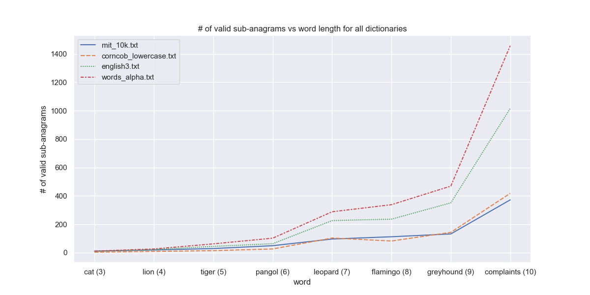

# Jumble-Solver

A solver for the game 'Jumble'. Given a dictionary and any word, this program returns the possible anagrams and sub-anagrams. For any clarifications, contact me (Rishabh Bhattacharya) at [ribhattacharya@ucsd.edu](mailto:ribhattacharya@ucsd.edu). Happy Jumbling!

## Working instructions
### Create conda environment (_Optional unless you want to run `tests.py`_)
To create a conda environment, run this in the terminal (assuming you have [Anaconda](https://www.anaconda.com/download/) or [Miniconda](https://docs.conda.io/en/latest/miniconda.html) installed on your system).

    conda env create -f environment.yml

This will create a conda environment named `jupyter_solver` on your system, installing the required packages.

**NOTE**: You could completely skip this step, since the solver only uses native python packages. However, this is required if you want to run `tests.py` and plot graphs.

### Run script
To run the script, enter the following in your command line

    cd ~/path/to/Jumble-Solver
    python3 jumble_solver.py YOUR_DICTIONARY.txt YOUR_WORD

For example, given the (default) dictionary `corncob_lowercase.txt` and the (default) word `dog`, we would run
    
    python3 jumble_solver.py corncob_lowercase.txt dog

Since these are default values, you could also run the same by entering

    python3 jumble_solver.py

Running either of the two commands above would give, this output.

    ------------------------------------------------------------------------------------
    Sub-anagrams found:     16
    Valid sub-anagrams:     4
    Valid sub anagrams are:  {'do', 'dog', 'go', 'god'}
    Time elapsed:           15.77 ms
    ------------------------------------------------------------------------------------

### Testing
To run the tests and view plots, run 

    python3 tests.py
## Repo structure

- **environment.yml**: Conda environment setup file.
- **constants.py**: Constant values like word file diectory. 
- **jumble_solver.py**: Main interface script for this problem. 
- **tests.py**: Script to perform testing and performance evaluation. 
- utils/
    - **file_utils.py**: File manipulation functions.
    - **test_utils.py**: Contains various utility functions for testing and visualizing performance.
    - **utils.py**: Contains various utility functions.
- scripts/
    - **sub_anagrams.py**: Compute all possible + valid sub-anagrams.
- dictionaries/
    - **mit_10k.txt**: [MIT 10K word list](https://www.mit.edu/~ecprice/wordlist.10000) (10K words)
    - **corncob_lowercase.txt** (default): [Corncob lowercase world list](http://www.mieliestronk.com/corncob_lowercase.txt) (58K words)
    - **english3.txt**: [English_3](http://www.gwicks.net/textlists) (194K words)
    - **words_alpha.txt**: [words_alpha](https://github.com/dwyl/english-words/blob/master/words_alpha.txt) (370K words)
    
## Features
1. Checks if dictionary file exists and if input word contains alphabets, else raises error.
2. Dictionary is implemented as a hashset, so sorting is not needed and duplicate elements are rejected inherently.
3. Handles upper/lower case and combinations by converting the dictionary and input word to lowercase for uniformity across permutations and search.
4. The sub-anagrams are also stored as hashsets. Thus even if input word has duplicate alphabets, the sub-anagrams are unique.
5. Search takes $O(1)$ complexity on average due to the `set` inplementation.

## Algorithm
The **algorithm** is as follows:

1. Check if the dictionary exists and the input words is valid.
2. Read the dictionary and store it as a set.
3. Permute the sub-anagrams and check if it exists in the dictionary. If yes, store it in another set.
4. Return the set of all valid sub-anagrams.

I used Python's hashset `set()` for this implementation. Insertion in both `set()` and `List[]` take $O(1)$ time. However, the current implementation (using `set()`) improves upon the previous build (using `List[]` and binary search) majorly due to two factors,

1. Search in a `set()` takes $O(1)$ time, and it is not required to be sorted. In contrast, binary-search in a sorted `List[]` takes $O(\log m)$ time, and the sorting (if dictionary is unsorted) itself takes $O(m\log m)$ time. Both end up taking the same space $O(m)$.
2. If the input word has repeated characters, there would be duplicate permutations when adding in a `List[]`. Rather than trying to remove duplicates separately, adding elements in a `set()` ensures that no duplicates are added. Both methods take $O(1)$ time to append each element, but we achieve duplicate removal as a bonus by using `set()`.

## Complexity analysis
If dictionary has $m$ words and input word has $n$ characters, then 
- **Reading dictionary**: Time: $O(m)$, Space: $O(m)$
    - Traversal over dictionary.txt file: $O(m)$
    - Adding to set: $O(1)$ for each element in dictionary
    - **Total time**: $O(m)$
    - **Total space**: $O(m)$
- **Computing all possible sub-anagrams**:Time: $O(\lfloor n! \times e\rfloor)$, Space: $0$
    - Permuting _r_ letters at a time: $O({}^n P_r)$
    - Adding to set: $O(1)$ for each element
    - **Total time**: $O({}^n P_n + {}^n P_{n-1} + \cdots {}^n P_1 + {}^n P_0) = O(\sum_{r=0}^n {}^n P_r) = O(\lfloor n! \times e\rfloor)$. See this [link](https://math.stackexchange.com/questions/161314/what-is-the-sum-of-following-permutation-series-np0-np1-np2-cdots-npn) for the derivation.
    - **Total space**: $0$, since `permutations` from `itertools` uses `yield` to return values, so the values are not stored at the same time. Also we are only storing the words that have been found in the dictionary. This happens in the search step. 
- **Search for valid sub-anagrams**: Time: $O(1)$, Space: $O(k)$ where $k$ is the number of valid matches in the dictionary.
    - Search for a sub-anagram in set of words (dictionary): $O(1)$
    - **Total time**: $O(1)$
    - **Total space**: $O(k)$

Thus given $m$ words in the dictionary, input word of length $n$, and $k$ sub-anagram matches in the dictionary, we have
| Step # 	| Step description                    	| Time complexity                        	| Space complexity 	|
|--------	|-------------------------------------	|----------------------------------------	|------------------	|
| 1      	| Reading dictionary                 	| $O(m)$                                 	| $O(m)$           	|
| 2      	| Computing all possible sub-anagrams 	| $O(\lfloor n! \times e\rfloor)$        	| $0$              	|
| 3      	| Search for valid sub-anagrams       	| $O(1)$                                 	| $O(k)$           	|
|        	| **Total**                           	| $O(m) + O(\lfloor n! \times e\rfloor)$ 	| $O(m+k)$         	|

The total time complexity has a peculiarity, where the dominant term can either be the length of the dictionary $O(m)$ or the length of the input word $O(\lfloor n! \times e\rfloor)$, which would determine the bottleneck. This has been elaborated in the [results](#results) section.

The complexities are thus given by 
$$\boxed{\text{Time complexity}: O(m) + O(\lfloor n! \times e\rfloor)}$$
$$\boxed{\text{Space complexity}: O(m+k)}$$
where $m$ is the length of dictionary, $n$ is the length of the word, $k$ is the number of sub-anagrams matched in the dictionary and $e=2.71 \cdots$ is the Euler number.

## Results

I chose the following dictionaries and words to compare and evaluate a comprehensive performance overview.

    dictionaryNames = ['mit_10k.txt', 'corncob_lowercase.txt', 'english3.txt', 'words_alpha.txt']
    words = ['cat', 'lion', 'tiger', 'pangol', 'leopard', 'flamingo', 'greyhound', 'complaints'] # There's very few 10 letter animals :-(

It is clear from the graph above that permutations of longer words are more time consuming. We also see an increasing trend of time with the size of dictionary. Note that
 
- the runtime for $n \leq 7$ (_cat_ to _pangol_) is similar for a given dictionary, and does not change much with $n$ (_word length_). This region is where **$O(m)$ dominates**, and thus the runtime looks uniform for a given dictionary, regardless of the input word length $n$.
- $n=\{7,8\}$ is where no clear dominating effect emerges, and is based on which dictionary has been chosen. This is kind of the **transition** region.
- However, we start seeing a sharp increase at $n=9$. This is where $O(\lfloor n! \times e\rfloor) >> O(m)$, and the **sub-anagram computation dominates** the reading of all dictionaries.   

I attempt to support this claim by the following.

| Dictionary              	| # of words ($m$)|
|-------------------------	|------------	  |
| `mit_10k.txt`           	| 10,000      	  |
| `corncob_lowercase.txt` 	| 58,000      	  |
| `english3.txt`          	| 194,000      	  |
| `words_alpha.txt`       	| 370,000      	  | 

| Word length $n$ 	| $O(\lfloor n! \times e\rfloor)$ i.e. computation time for sub-anagrams 	| Compared to $O(m)$ i.e. reading dictionary (refer table above)                                                                                              	|
|-----	|------------------------------------------------------------------------	|-------------------------------------------------------------------------------------------------------------------------------------------------	|
| 1   	| 2                                                                      	| Computation time for sub-anagrams < reading all dictionaries                                                                                    	|
| 2   	| 5                                                                      	| Computation time for sub-anagrams < reading all dictionaries                                                                                    	|
| 3   	| 16                                                                     	| Computation time for sub-anagrams < reading all dictionaries                                                                                    	|
| 4   	| 65                                                                     	| Computation time for sub-anagrams < reading all dictionaries                                                                                    	|
| 5   	| 326                                                                    	| Computation time for sub-anagrams < reading all dictionaries                                                                                    	|
| 6   	| 1957                                                                   	| Computation time for sub-anagrams < reading all dictionaries                                                                                    	|
| 7   	| 13700                                                                  	| Computation time for sub-anagrams > reading `mit_10k.txt` (10K words). Other dictionaries are still the bottleneck.                             	|
| 8   	| 109601                                                                 	| Computation time for sub-anagrams > reading `mit_10k.txt` (10K) and `corncob_lowercase.txt` (58K). Other dictionaries are still the bottleneck. 	|
| 9   	| 986410                                                                 	| Computation time for sub-anagrams > reading all dictionaries. From $n \geq 9$ onwards, sub-anagram computation is the bottleneck.               	|

Thus we see that for the given 4 dictionaries, 
 
- For $n \leq 6$, the **dictionary read/write is the bottleneck**.  
- For $n=\{7,8\}$, the **bottleneck depends on which dictionary has been chosen**.
- For $n \geq 9$ **sub-anagram computation is always the bottleneck**.

This analysis lets us focus on which process to prioritize and optimize. I believe that most words that we play with will be less than 9 characters in length. This means that we would **benefit a lot by optimizing the dictionary read/write process into the working memory**.

We also see a dramatic increase of the number of valid sub-anagrams with word length. There is one anomaly, i.e. for `mit_10k` and `corncob_lowercase`. We would expect the former to result in less valid sub_anagrams, since it has lesser words (10K vs 58K). However, this does not happen because the `mit_10k` dictionary contains many nonsensical words, as evidenced by the following. 

    $ python3 jumble_solver.py mit_10k.txt dog 
    ------------------------------------------------------------------------------------
    # of all possible sub-anagrams: 16
    # of valid sub-anagrams:        10
    Valid sub-anagrams are:          {'go', 'o', 'g', 'god', 'do', 'dg', 'og', 'd', 'dog', 'gd'}
    Time elapsed:                   2.77 ms
    ------------------------------------------------------------------------------------

We can see that {'o', 'g', 'dg', 'og', 'gd'} are not actual words, and are hence not found in the `corncob_lowercase` dictionary, but are present in the `mit_10k` dictionary. This leads to many extraneous sub-anagrams. This problem only gets worse for longer words.
## Future functionality improvements
1. If we have repeating characters in the input word, the duplicate permutations are currently computed before attempting to add into the `set()`. A further optimization could be to skip this computation itself.
2. We could read the input word and only load corresponding sections from the dictionary. Eg, for input 'dog', we can only load words that start with 'd', 'o' or 'g'. This would reduce the space complexity manyfold, but introduce multiple checks for each word in the dictionary ($O(3m)$ in this case: $m$ words being checked thrice against 'd', 'o' and 'g'). Thus there is a tradeoff between space and time complexity. And we already discussed that for $n \leq 6$, and for some cases of $n=\{7,8\}$, $O(m)$ is dominating. Thus $O(3m)$ would be a even bigger hit to the runtime.
